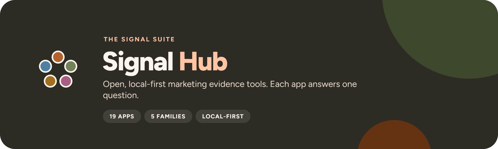

<p align="center"></p>

<p align="center">
  <a href="https://github.com/UlrikErlingsen/signal-hub/actions"></a>
  <a href="https://github.com/topics/signal-suite"></a>
  
  
  <a href="LICENSE"></a>
</p>

<p align="center"><strong>Twenty small apps. Each answers one marketing question, shows its method, and runs on your own machine.</strong></p>

**Signal Hub** is one Streamlit app that puts all twenty Signal tools behind a single link: a front page, a sidebar menu by
family, and every released tool running inside it with its fictional demo already loaded. It assembles apps that
already exist. Each tool stays its own repository and Python package, and the Hub pins released versions.

Everything runs locally with open-source Python packages. There is no account, telemetry, external AI call, remote
database, or built-in persistence. Uploads stay in your session's memory.

<!-- signal-apps:start (generated from apps.yaml by scripts/sync_suite.py) -->

##  Brand

| | App | Question | Repo |
|---|---|---|---|
|  | **Track Signal** | Is the brand moving, or is the tracker just noisy? | [brand-tracking](https://github.com/UlrikErlingsen/brand-tracking) |
|  | **Position Signal** | Where do brands sit relative to competitors? | [brand-positioning](https://github.com/UlrikErlingsen/brand-positioning) |

##  Market

| | App | Question | Repo |
|---|---|---|---|
|  | **Prospect Signal** | Which Norwegian companies fit your ideal customer, and which first? | [b2b-prospecting](https://github.com/UlrikErlingsen/b2b-prospecting) |
|  | **Listen Signal** | Who is talking about the brand in Norwegian media, and in what tone? | [media-listening](https://github.com/UlrikErlingsen/media-listening) |
|  | **Influence Signal** | Which creators delivered, and was every post labelled properly? | [influencer-campaigns](https://github.com/UlrikErlingsen/influencer-campaigns) |
|  | **Season Signal** | What does the Norwegian marketing year look like, worked backwards? | [marketing-calendar](https://github.com/UlrikErlingsen/marketing-calendar) |
|  | **Adopt Signal** | When will a new product be adopted? | [adoption-forecasting](https://github.com/UlrikErlingsen/adoption-forecasting) |

##  Customer

| | App | Question | Repo |
|---|---|---|---|
|  | **Worth Signal** | What are customers and relationships worth? | [customer-value-analytics](https://github.com/UlrikErlingsen/customer-value-analytics) |
|  | **Segment Signal** | Do customers form stable, useful groups? | [customer-segmentation](https://github.com/UlrikErlingsen/customer-segmentation) |
|  | **Trace Signal** | How do logged customer journeys actually unfold? | [journey-path-analysis](https://github.com/UlrikErlingsen/journey-path-analysis) |
|  | **Recommend Signal** | Which recommendation policy should be tested live? | [recommender-evaluation](https://github.com/UlrikErlingsen/recommender-evaluation) |

##  Research

| | App | Question | Repo |
|---|---|---|---|
|  | **Choice Signal** | How do product attributes drive choice? | [conjoint-analysis](https://github.com/UlrikErlingsen/conjoint-analysis) |
|  | **Driver Signal** | Which measured experiences move with satisfaction? | [survey-driver-analysis](https://github.com/UlrikErlingsen/survey-driver-analysis) |
|  | **Measure Signal** | Does a multi-item score have a defensible structure? | [measurement-validation](https://github.com/UlrikErlingsen/measurement-validation) |
|  | **Text Signal** | What recurring patterns appear in open-ended responses? | [open-text-analysis](https://github.com/UlrikErlingsen/open-text-analysis) |
|  | **Tag Signal** | What price range is supported, and how does profit move? | [pricing-analysis](https://github.com/UlrikErlingsen/pricing-analysis) |

##  Decide

| | App | Question | Repo |
|---|---|---|---|
|  | **Experiment Signal** | Did the treatment cause a practically meaningful change? | [experiment-analysis](https://github.com/UlrikErlingsen/experiment-analysis) |
|  | **Gate Signal** | Does a concept deserve the next investment? | [launch-decision-gate](https://github.com/UlrikErlingsen/launch-decision-gate) |
|  | **Shift Signal** | Does a launch grow the portfolio, or move existing demand around? | [cannibalization-analysis](https://github.com/UlrikErlingsen/cannibalization-analysis) |
|  | **Alloc Signal** | Where should the next marketing budget go? | [marketing-mix-allocation](https://github.com/UlrikErlingsen/marketing-mix-allocation) |

<!-- signal-apps:end -->

## How the apps fit together

Apps hand off rather than overlap: a tracking contrast in Track Signal is not a causal effect, so it points to
Experiment Signal; construct scores need Measure Signal evidence first. Each README names its siblings under
**Read this first**.

## Run the Hub locally

You need Python 3.10 or newer.

**macOS:** double-click `run_app.command`. **Windows:** double-click `run_app.bat`.

The first launch creates a private `.venv` and installs every released app from its GitHub tag archive. Or use a
terminal:

```bash
python3 -m venv .venv
source .venv/bin/activate  # Windows: .venv\Scripts\activate
python -m pip install -r requirements.txt
python -m streamlit run hub/app.py
```

The Hub prefers local port 8610. The launchers accept `SIGNALHUB_PORT`, and `SIGNALHUB_DEBUG=1` shows technical
details when a tool fails.

### Docker

```bash
docker build -t signal-hub .
docker run --rm -p 8501:8501 signal-hub
```

Then open http://127.0.0.1:8501. The container runs as a non-root user. See [deploy/README.md](deploy/README.md).

## How it works

- [`apps.yaml`](apps.yaml) is the only list of apps. The sidebar, the front page and the smoke tests read it;
  `python scripts/sync_suite.py` writes everything else from it: the app tables above, the requirement pins, the
  theme's app list, topics, repo descriptions, and the suite table in every app's README.
- Adding an app takes one registry entry and a few commands: [docs/ADDING_AN_APP.md](docs/ADDING_AN_APP.md).
  `python scripts/scaffold_app.py <slug>` gives a new repo the standard files.
- An app joins the Hub by exposing `<package>.ui.render()`: the [app contract](docs/APP_CONTRACT.md). Inside the Hub
  apps run in Hub mode (`SIGNAL_HUB=1`): session memory only, fictional demo data, no network calls or disk writes.
- To update an app: release it (version, CHANGELOG, tag `vX.Y.Z`), change its `tag:` in `apps.yaml`, run
  `python scripts/sync_suite.py`, test, redeploy. Unfinished work in an app never reaches the Hub.
- Current state per app: [docs/STATUS.md](docs/STATUS.md).

## Shared design

`signal-theme/` is the master copy of the suite's look: `signal_theme.py` (theme, lockups, chart palette), marks,
README banners, social previews, the README template, the app template (`signal-theme/app-template/`) and repo topics.
`python scripts/sync_suite.py` copies it into every app clone; `--check` reports stale copies. Rollout recipe: [docs/BRAND_ROLLOUT.md](docs/BRAND_ROLLOUT.md).

## Development

```bash
python -m pip install -r local-apps.txt -e ".[test]"   # apps as editable sibling clones
python -m pytest
python -m ruff check .
```

`pytest -m "not apps"` runs the Hub's own tests without the apps installed. The `apps` tests render every embedded
app inside the Hub wrapper and check its version against `apps.yaml`.

## Privacy

The Hub has no telemetry, analytics scripts, accounts or external AI calls, and it never writes uploads to disk. On
a hosted deployment, the operator is responsible for the server. See [PRIVACY.md](PRIVACY.md).

## Originality and license

The software and documentation are free under AGPL-3.0-or-later. The suite is built with AI-assisted development:
Ulrik Erlingsen specifies, reviews and ships each release. It is new and makes no real-user or traction claims.

---

All repos carry the `signal-suite` topic: [browse them](https://github.com/topics/signal-suite). Freddo CRM is a
separate product ([demo](https://freddo.ulrikerlingsen.com)).
By [Ulrik Erlingsen](https://ulrikerlingsen.com) · AGPL-3.0-or-later
